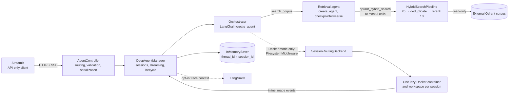

# Architecture

`ragchat` is a local, single-user proof of concept. Streamlit is an API-only
client; Litestar owns HTTP and SSE; the manager owns agents, sessions, and
lifecycles; Qdrant is an externally populated, read-only dependency.

## Ownership and boundaries

| Area | Owns | Must not own |
| --- | --- | --- |
| `ui/streamlit_app.py` | API calls, SSE rendering, chat UI | Imports from `ragchat`, direct model/Qdrant access |
| `controller.py` | The four routes, request validation, status translation, SSE serialization | Agent, retrieval, session, or sandbox policy |
| `app.py` | Litestar construction and manager startup/shutdown lifespan | Runtime decisions |
| `manager.py` | Dependency composition, graph, sessions, locks, checkpoints, telemetry, domain-event stream | Litestar or other HTTP types |
| `agents/` | Orchestrator and retrieval-agent composition | HTTP and direct Qdrant construction |
| `retrieval/` | Corpus validation and the exact hybrid/rerank pipeline | Ingestion or collection repair |
| `sandbox/` | Session-routed file/execute tools, Docker lifecycle, image artifacts | Corpus or model access |
| `config.py`, `domain.py`, `prompts/`, `providers.py` | Strict startup configuration, framework-free contracts, prompts, one selected model runtime | Per-request provider switching or fallback |

## Startup and runtime flow

At startup, one strict `Settings` object selects either vLLM or OpenAI; there
is no request-time choice and no fallback. vLLM is the default and uses
`ChatOpenAI` with one injected `AsyncOpenAI` client. Both `async_client` and
`root_async_client` are supplied so LangChain keeps that client on async request
paths. The OpenAI implementation is a lazy, isolated branch in
`openai_backend.py` and is removable without changing vLLM.

`build_components()` creates that one chat-model instance, validates Qdrant,
and loads one shared vector store and reranker. The same chat model drives the
orchestrator and every retrieval-agent invocation. Docker is checked and its
modules are loaded only for `SANDBOX_MODE=docker`. The application lifespan
creates `DeepAgentManager` with an `InMemorySaver` and shuts down all sessions
on exit.

For a chat turn, the controller asks the manager for an event iterator before
constructing the SSE response, so unknown and overlapping sessions become 404
and 409 responses. The manager invokes the orchestrator with
`thread_id == session_id`, then serializes only domain events through the
controller as `progress`, `message`, `artifact`, `done`, or `error` SSE events.
Unexpected runtime errors become a generic public error rather than leaking
prompts, credentials, scores, or internals.

Optional LangSmith tracing is also startup-configured. The manager owns one
client and wraps each consumed outer graph stream in a trace context, which
propagates through nested retrieval and tool execution without changing HTTP,
retrieval, sandbox, or checkpoint ownership. The context closes on completion,
failure, disconnect, or early stream closure, and the client flushes during
manager shutdown even if session cleanup fails. Disabled mode creates no client
and explicitly suppresses ambient tracing.

## Agent and streaming decisions

Both modes use `langchain.agents.create_agent`, not `create_deep_agent`.
Deepagents 0.7.5 protects its filesystem and subagent middleware, so
`create_deep_agent` cannot provide the required RAG-only mode with exactly one
tool and no file or execution surface. Manual composition keeps both modes
symmetric: the orchestrator always receives only `search_corpus`, and Docker
mode additionally receives deepagents' `FilesystemMiddleware`.

The manager calls the outer graph with
`stream_mode=["messages", "custom"]`, `subgraphs=True`. LangGraph therefore
yields `(namespace, mode, payload)` triples and propagates `get_stream_writer()`
events from the retrieval graph nested inside `search_corpus`. Custom payloads
are validated as domain events. Assistant token chunks are forwarded only when
`namespace == ()`; tool-subgraph namespaces such as `("tools:<id>",)` are
discarded, so retrieval reasoning never reaches the user.

Search/review/preparation notices are custom events emitted immediately around
the exact model-chosen query. They are transient, not conversation messages.
The inner retrieval agent is rebuilt per `search_corpus` invocation with
`checkpointer=False`, preventing it from inheriting the outer saver. Thus its
messages and progress are neither checkpointed nor replayed; only the root
conversation uses the per-session in-memory checkpoint.

## Retrieval and evidence boundary

Qdrant is validated, never repaired. Startup uses only `collection_exists`,
`scroll`, and the vector store's `get_collection` checks to require a non-empty
collection, compatible named vectors, and payload fields `page_content`,
`metadata.source`, and `metadata.page`. Runtime uses only `query_points`; there
are no create, upsert, update, or delete paths.

The pipeline is fixed:

1. Embed with `sentence-transformers/all-mpnet-base-v2` and sparse
   `Qdrant/bm25`.
2. Ask `QdrantVectorStore` in `HYBRID` mode for 20 candidates. Qdrant performs
   dense and sparse prefetch and reciprocal-rank fusion.
3. Deduplicate by stable point ID from `metadata["_id"]`, preserving the first
   fused occurrence.
4. Score every remaining pair with the shared `BAAI/bge-reranker-base`
   cross-encoder and return at most the top 10.

The retrieval model controls query formulation, sufficiency, and re-querying;
application code enforces only the maximum of three searches. Its structured
result contains an interpretation plus selected point IDs, never model-copied
source text. Application code resolves those IDs only against passages observed
during that invocation and inserts the original `page_content` verbatim with
source and page. Unknown IDs are dropped and reported as gaps. The orchestrator
is instructed to verify every claim against this evidence rather than trust the
retrieval summary.

## Sessions, checkpoints, and optional sandbox

Each session owns an `asyncio.Lock`; an already-held lock fails immediately
with 409 rather than queuing. The lock is acquired before returning the stream
and released in the stream generator's `finally`. Deletion refuses a busy
session, then closes its sandbox and deletes its checkpoint. Shutdown closes
all remaining sandboxes and clears all in-memory conversation state; no session
survives an API restart.

Deepagents accepts one backend instance at graph construction time, so Docker
mode uses `SessionRoutingBackend`. It reads the current LangGraph `thread_id`
and delegates file and execute calls to that session's handle. Session creation
allocates only a workspace and filesystem backend; its container starts lazily
on first execution. File tools see virtual `/`, while shell commands run in
`/workspace` through a fresh `/bin/sh -lc` process for each command.

The container has no network, a read-only root filesystem, all capabilities
dropped, `no-new-privileges`, CPU/memory/PID/time/output limits, and exactly one
read-write mount: its session workspace. It receives neither the corpus nor
Qdrant credentials. On Linux, container creation and command execution use the
workspace owner's numeric UID:GID; deployments should run the API as a
dedicated non-root host user. GNU `timeout` owns each command process group,
with a small outer Docker CLI grace and a token-scoped cleanup pass for escaped
background processes. CLI pipes are drained continuously into bounded capture
buffers. Before and after execution, the backend snapshots regular
PNG/JPEG/WebP files without following links. Changed images within the raw-byte
cap become inline base64 `artifact` events with workspace-relative names;
oversized or raced files are skipped, and host paths are never exposed.
